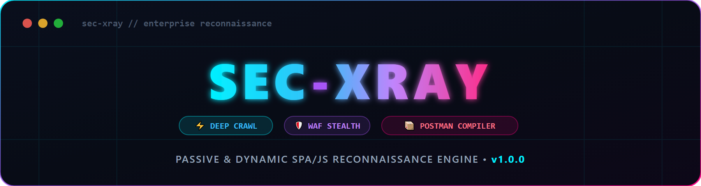

<div align="center">
  

  <br/><br/>

  [](https://www.python.org/downloads/)
  [](https://playwright.dev/python/)
  [](https://opensource.org/licenses/MIT)
  [](https://github.com/AditCodeX/Sec-XRay)

  <br/><br/>

  <p align="center">
    <b>High-Performance Passive & Dynamic Reconnaissance Engine for Single Page Applications (SPA), React/Vue/Angular, and JavaScript Bundles.</b>
  </p>
</div>

---

## ⚡ Overview

**Sec-XRay v1.0.0** is a high-performance reconnaissance CLI tool designed to aggressively dissect Single Page Applications (SPA), React/Vue/Angular webapps, and JavaScript bundles. It extracts hidden API endpoints, JSON payload structures, query parameters, and hardcoded credentials.

Unlike traditional passive browser extensions, Sec-XRay operates using a **Headless Chromium engine** armed with **Anti-Bot Stealth Evasion (v2.0)**, allowing it to render the actual DOM, bypass WAFs (Cloudflare / Akamai), and trigger interactive events (`--deep` mode) to force lazy-loaded Webpack chunks out into the open.

---

## 💎 Key Features

- 🕵️ **Headless Interception + WAF Stealth:** Bypasses Cloudflare & Akamai challenges utilizing `playwright-stealth` (v2.0 evasions).
- 🚀 **Deep Crawl Engine:** Automatically clicks buttons, dropdowns, and links (Event-Driven DOM Trigger) to expose APIs hidden behind user interactions.
- 🗺️ **Source-Map Recovery:** Detects and reconstructs backend developer folder structures from leaked `.js.map` files.
- 📦 **Smart Postman Collection Generator:** Pieces together Endpoints + JSON Keys into ready-to-fuzz `POST` and `GET` requests inside an importable Postman JSON collection (strict per-source mapping, zero payload over-stuffing).
- 🔥 **Secret Leaks Scanner:** Employs heuristical regex to catch hardcoded AWS Keys, Google API Keys, JWT Tokens, and sensitive credentials with false-positive suppression (filtering UI labels & i18n keys).
- ⚙️ **Multi-Threaded Batch Scanning:** Feed it a `.txt` file with hundreds of subdomains and it will spin up concurrent browser workers.
- 🌐 **Global PATH Integration:** Single-click installers automatically configure your environment PATH so you can launch `sec-xray` from any terminal directory.

---

## 🛠️ Installation & Auto-PATH Setup

**Prerequisites:** Python 3.8 or newer with pip.

### 1. Clone Repository
```bash
git clone https://github.com/AditCodeX/Sec-XRay.git
cd Sec-XRay
```

### 2. Run the Auto-Installer (Auto-PATH Enabled)
The installer will automatically install all Python dependencies, download Chromium, register console entrypoints, and **add Sec-XRay to your User PATH**:

- **Windows:** Double-click `install.bat` or run in CMD / PowerShell:
  ```cmd
  .\install.bat
  ```
- **Linux / macOS:** Run in terminal:
  ```bash
  chmod +x install.sh
  ./install.sh
  ```

*(Pythonistas can also install directly via: `pip install -e . && playwright install chromium`)*

---

## 🚀 Instant Global Execution

Once installed, restart your terminal or open a new tab. You can now launch **Sec-XRay from any directory**:

```bash
sec-xray
```

---

## 🎯 Usage Guide

### Supported Target Formats
| Target Format | Description & Behavior | Command Example |
| :--- | :--- | :--- |
| **Domain / URL** | Single URL/domain scan with dynamic network interception. | `scan target.com` |
| **Batch List (.txt)** | Multi-threaded scanning over a text file of URLs (1 per line). | `scan subdomains.txt --threads 5` |
| **Batch Deepscan (.txt)** | Aggressive clicking/DOM rendering over a batch list. | `deepscan subdomains.txt --threads 4` |
| **Local File (.js / .html)** | Static extraction of local bundles without opening a browser. | `scan app.bundle.js` |

### Interactive Commands
Inside the `sec-xray ❯` shell:

*   **`scan <target>`** : Starts passive & dynamic JS intercept scan.
*   **`scan <target> --deep`** : Starts full scan with DOM button/link clicking (Max 15s/page).
*   **`deepscan <target>`** : Direct shortcut for deep DOM crawling (`--deep`).
*   **`scan <list.txt> --threads N`** : Multi-browser concurrent batch scan.
*   **`show`** : Displays overall summary table & highlighted leaked credentials.
*   **`show endpoints`** : Drills down into all extracted routes and endpoints.
*   **`show secrets`** : Drills down into all detected sensitive leaks / API keys.
*   **`show params`** : Drills down into all query parameters.
*   **`show keys`** : Drills down into all JSON payload keys.
*   **`clear`** : Purges the session findings from RAM.
*   **`help`** / **`?`** : Displays the command reference and flag guide.
*   **`exit`** / **`quit`** : Exits the interactive shell.

---

## 📊 Outputs & Artifacts

After every scan, **Sec-XRay** automatically deduplicates your findings and exports them directly into your current working directory:

1.  **`<target>.csv`** : Clean dataset of unique `Endpoints`, `Query Params`, `JSON Keys`, and `Secret Leaks` with aggregated sources.
2.  **`<target>_postman.json`** : Ready-to-use Postman Collection v2.1. Drag-and-drop into Postman or Burp Suite to immediately begin API fuzzing with pre-populated parameters!

---

## ⚠️ Legal Disclaimer

Sec-XRay is developed strictly for **educational purposes, ethical hacking, and authorized penetration testing**. 
The authors and contributors are **NOT** responsible for any misuse, damage, or illegal activities caused by utilizing this tool. Only run Sec-XRay against systems you own or have explicit, documented permission to test.

---
<div align="center">
  <i>"May your Recon be deep, and your Bugs be critical."</i>
</div>
